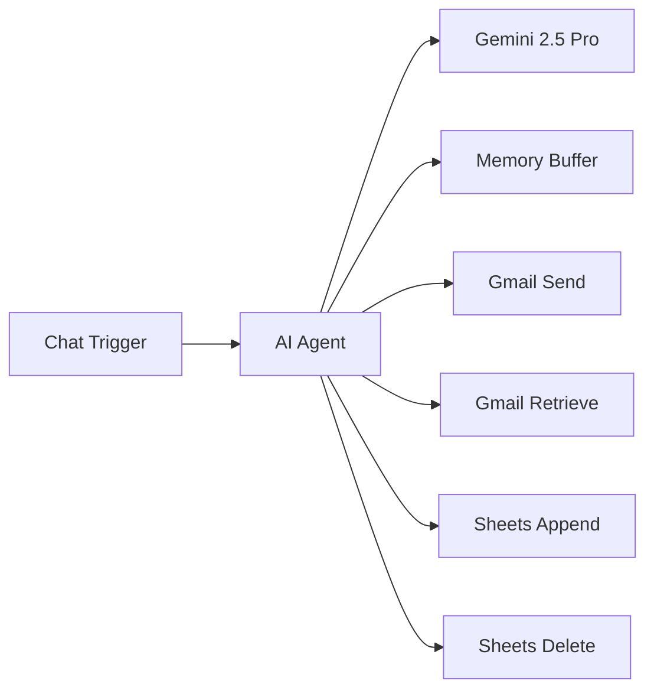
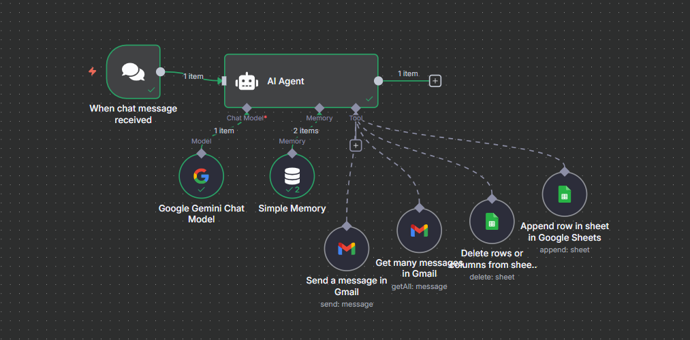
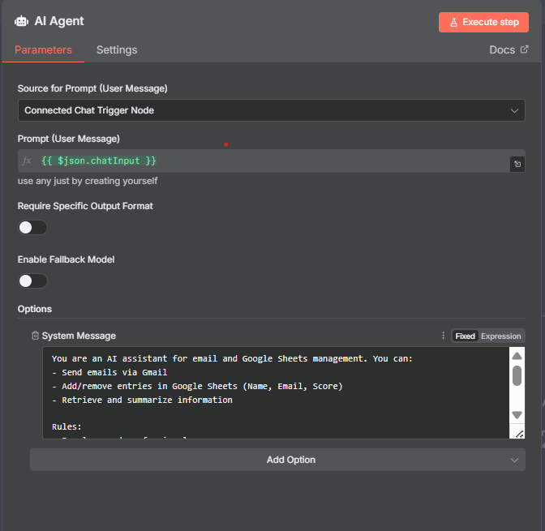
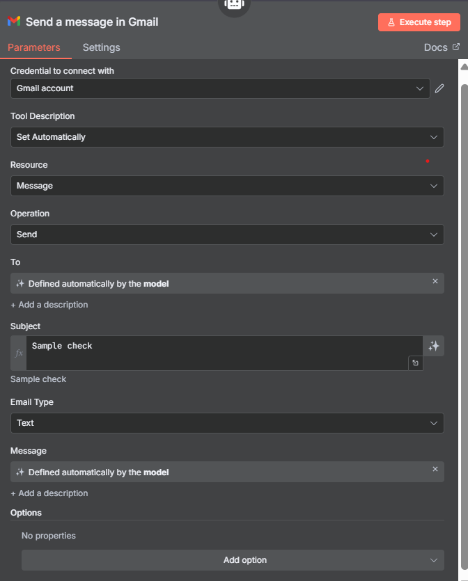
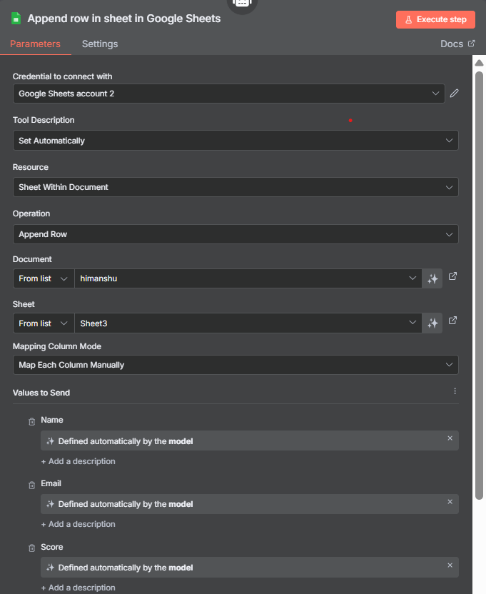

# 🤖 AI Email Agent - n8n Automation

> An intelligent n8n workflow that combines AI-powered email management with Google Sheets automation using Google Gemini 2.5 Pro.

## 🌟 Features

### 📧 Email Management
- **Send Emails**: AI agent can compose and send emails via Gmail
- **Retrieve Emails**: Fetch and analyze your Gmail messages
- **Smart Responses**: Context-aware email handling with conversation memory

### 📊 Google Sheets Integration
- **Append Data**: Add new rows with Name, Email, and Score columns
- **Delete Rows**: Remove specific rows based on AI instructions
- **Dynamic Data**: AI extracts and structures data automatically

### 🧠 AI Capabilities
- **Google Gemini 2.5 Pro**: Latest AI model for intelligent responses
- **Memory Buffer**: Maintains conversation context across interactions
- **Natural Language**: Chat-based interface for easy interaction

## 🏗️ Workflow Architecture



## 📋 Prerequisites

Before setting up this workflow, ensure you have:

- [ ] **n8n instance** (self-hosted or cloud)
- [ ] **Google Gmail account** with API access
- [ ] **Google Sheets** with appropriate permissions
- [ ] **Google Gemini API key** (PaLM API)
- [ ] **OAuth2 credentials** for Google services

## 🚀 Quick Start

### 1. Import the Workflow

1. Download the `email-agent-workflow.json` file
2. Open your n8n instance
3. Click **Import from File**
4. Select the downloaded JSON file
5. Click **Import**

### 2. Configure Credentials

#### Gmail OAuth2
1. Go to **Credentials** → **Create New**
2. Select **Gmail OAuth2 API**
3. Follow the OAuth2 setup process
4. Test the connection

#### Google Sheets OAuth2
1. Create **Google Sheets OAuth2 API** credential
2. Complete the authentication flow
3. Verify access to your target spreadsheet

#### Google Gemini API
1. Get your API key from [Google AI Studio](https://ai.google.dev/)
2. Create **Google PaLM API** credential
3. Enter your API key

### 3. Update Configuration

#### Google Sheets Settings
Update the following in the workflow:
- **Document ID**: Replace with your Google Sheets ID
- **Sheet Name**: Update to your target sheet name
- **Column Mapping**: Adjust columns as needed

#### Email Settings
- **Subject Line**: Customize default email subject
- **Sender Settings**: Configure as needed

## 💬 Usage Examples

### Send an Email
```
"Send an email to john@example.com with the subject 'Meeting Tomorrow' and message 'Hi John, don't forget about our meeting tomorrow at 2 PM.'"
```

### Retrieve Emails
```
"Get my latest emails from Gmail"
```

### Add Data to Sheets
```
"Add a new row to the sheet with Name: 'John Doe', Email: 'john@example.com', Score: '95'"
```

### Delete Rows
```
"Delete rows 5 to 7 from the spreadsheet"
```

## 📸 Screenshots

### 1. Workflow Overview

*Figure 1: Complete workflow showing all connected nodes*


### 2. AI Agent Configuration


*Figure 2: AI Agent node configuration with system message*


### 3. Gmail Node Setup


*Figure 3: Gmail node configuration for sending emails*


### 4. Google Sheets Integration


*Figure 4: Google Sheets node configuration for data management*


## 🔧 Customization

### System Message
Modify the AI agent's system message to change its behavior:

```
You are a Email assistant who can send and get my personal emails. 
As well as you are a google sheet assistant who can append rows in specified sheet with my given data entries.
```

### Memory Configuration
Adjust the memory buffer window size for longer/shorter conversation context.

### Sheet Schema
Customize the Google Sheets columns by modifying the schema in the append node:
- Name
- Email  
- Score

## 🛠️ Troubleshooting

### Common Issues

**Authentication Errors**
- Verify OAuth2 credentials are properly configured
- Check API quotas and limits
- Ensure proper scopes are granted

**Workflow Not Triggering**
- Check webhook URL is accessible
- Verify chat trigger configuration
- Test with manual execution first

**Google Sheets Errors**
- Confirm sheet ID and name are correct
- Verify write permissions
- Check column mapping matches sheet structure

## 📝 License

This project is open source and available under the [MIT License](LICENSE).

## 🤝 Contributing

Contributions are welcome! Please feel free to submit a Pull Request.

1. Fork the repository
2. Create your feature branch (`git checkout -b feature/AmazingFeature`)
3. Commit your changes (`git commit -m 'Add some AmazingFeature'`)
4. Push to the branch (`git push origin feature/AmazingFeature`)
5. Open a Pull Request

## 📞 Support

If you encounter any issues or have questions:

- 📧 Email: [himanshufirke04@gmail.com]
- 💬 GitHub Issues: [Create an issue](../../issues)
- 📖 n8n Documentation: [n8n.io/docs](https://docs.n8n.io/)

## 🙏 Acknowledgments

- **n8n Team** - For the amazing workflow automation platform
- **Google** - For Gmail, Sheets, and Gemini AI APIs
- **Community** - For inspiration and feedback

---

⭐ **Star this repository if you found it helpful!**
